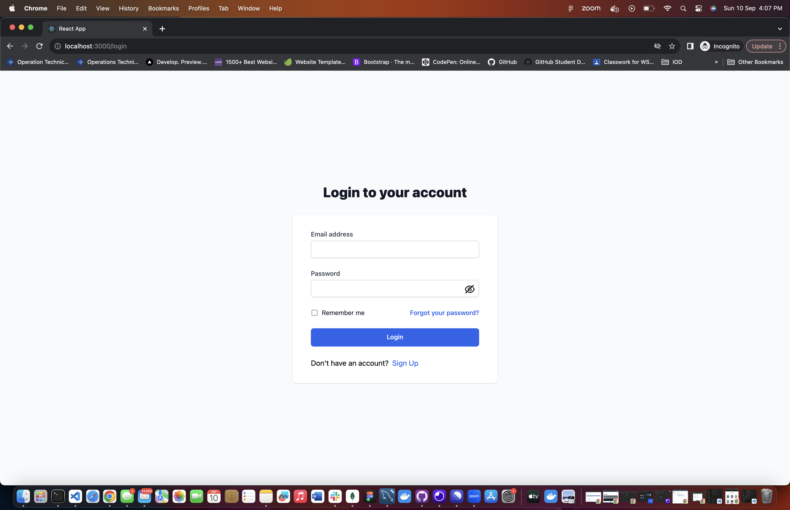
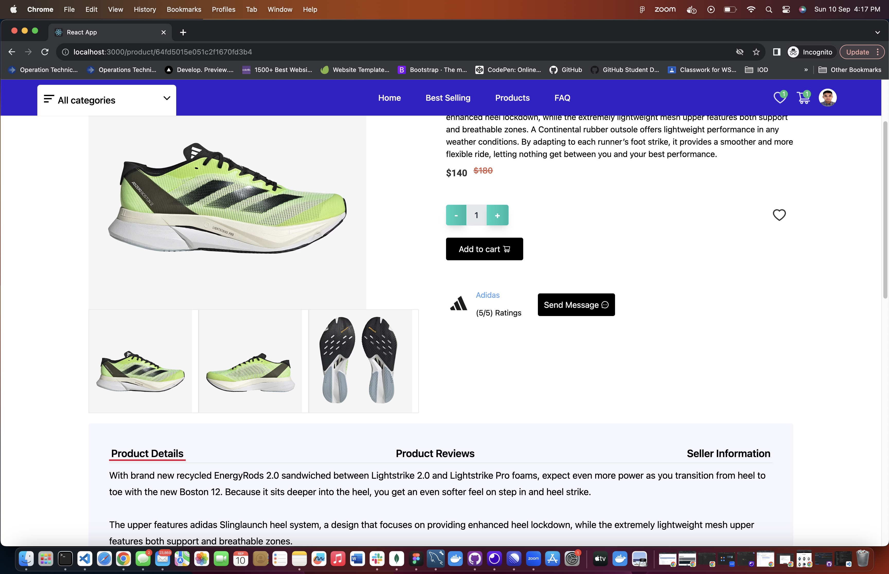

# E-commerce Capstone (Running Products)

This project was created using React JS. Log-in verification is achieved by using the jsonwebtoken. The images are for products, users and sellers are stored in the multer diskstorage. There are still a few incomplete features due to my incompetency and still in the process of learning.

---

### Homepage

  

  

  

  

Users will be presented with this homepage and able to view products on their webpage. In the homepage, in the header tabs, users will be able to toggle between "Home", "Best Selling", "Products" and "FAQ". The difference between Best Selling and Products tab, in the Best Selling page, it sorts all products from highest to lowest product sold. Whereas in Products tab, it displays all products not sorted to any function. Users without the need to create an account, are able to add items to wishlist and cart.

---

### Registration & Log In Screen

  

  

Users are required to sign up and log in with the required fields to make checkout items that has been added to cart. Upon successful registration, user will receive an activation token in their registered email. After successfully activating the token, user will now be able to login and will be redirect to the homepage as shown previously.

---

### Product Details

  

Upon users clicking on the product card, it will lead to the individual product page as shown above where users can see the products reviews, ratings and also Seller information. Also, users will be able to add to cart or wishlist from this page.

---

### Checkout Page

  

After users added their items to cart and checks out, users will be directed to the page shown above where this checkout page consists of 3 steps. After filling up the address fields, user will click to make payment which will be directed to the credit card page.

---

### Seller Registration

  

Users who has registered will have access to register as seller.

---

### Seller Dashboard

  

  

  

  

  

Upon successfully register as the seller, sellers will have access to this dashboard where sellers can view all products in their shop, create product, view all orders request and create discount codes for customers. In the settings, sellers will be able to update their information such as shop name, shop description and shop address.

---

### Admin Dashboard

  

  

This is the admin dashboard where admin users have access to all orders from all shops, all sellers, all users, all products from all shops. In the admin settings, it has the same functionality as user settings just with the additional "Admin Dashboard" in the sidebar.

---

### Conclusion

This may not look like the best e-commerce website you have come across, as there are still many improvements that could be made. Just to inform that there are certain function that are still in progress such as the message function and also the event function. Apologies for the inconvenience.
